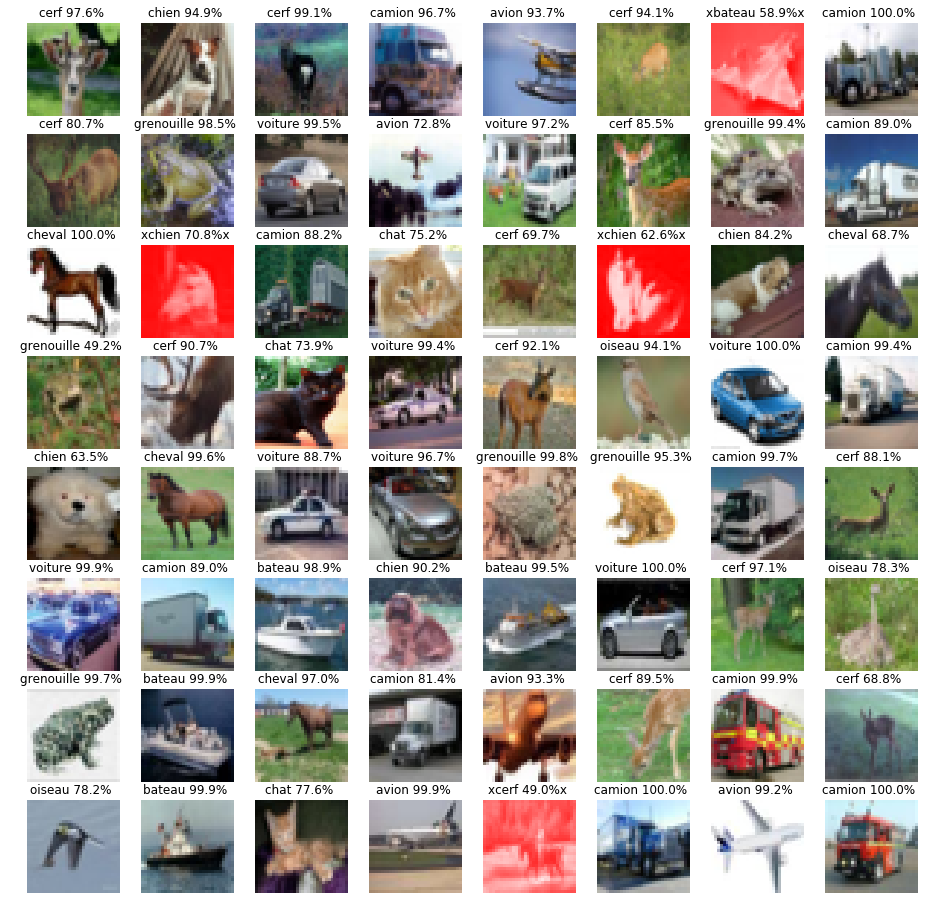

# CIFAR10

Dans cette exemple nous utilisons le jeu de donnée de CIFAR10 (disponible à l'adresse suivante https://www.cs.toronto.edu/~kriz/cifar.html) pour apprendre a classer des images avec 10 types différents.

## Présentation de CIFAR10
Cette base de données est composé 50 000 images pour faire l'apprentissage et 10000 images pour tester notre algorithme d'apprentissage, Les images sont réparties en 10 classes:  Avion, voiture, oiseau,chat, cerf, chien, grenouille, cheval, bateau et camion

<p style="text-align:center;"></p>

le jeu de donnée CIFAR a été developpé par l'université de Toronto et est un des jeu de données les plus utilisé en recherche en IA pour la reconnaissance d'objet. Il est utilisé surtout pour tester les capacités d'apprentissage des algorithmes d'apprentissage artificiel comme les réseaux de neurones.
Il y a un autre jeu de donnée , CIFAR100, ou le but d'apprendre à reconnaitre 100 classes d'objet différents, dont dix classes de CIFAR10


## Developpement

On utilise la librairie pytorch qui permet de créer des réseaux de neurones de manière optimisé et qui à déjà intégré l'ensemble des formules mathématiques qui permettent de créer un réseau de neurone et de faire son apprentissage.
Nous utilisons la librairie torchvision également afin qu'on puisse envoyer les données dans le réseau de neurone.

## Réseau de neurone convolutifs

Les réseaux de neurones prennent en entré  un vecteur de variable qui sont des informations numériques des entiers, des décimal ( float)....
<p style="text-align:center;"></p>

Une image est composé de pixel et chaque pixel est  caractérisé par 3 variables, pour le systeme RGB ( rougle vert bleu) qui permet de creer les couleurs. Donc pour passer apprendre a classer des images d'objet il faut donner au réseau de neurone l'ensemble des pixels de l'image. Par exemple pour une image qui fait 64x64pixel, le réseau de neurone a 64x64x3 = 12288 variables en entrée. On a vu avec l'exemple de mnist que cela ne fonctionne pas très bien.

Depuis plusieurs années, il y a eu des recherches pour réduire le nombre de variable que l'on donne au réseau, a la place de donner des images bruts. D'abord parce que avec le nombre de variable en entré le réseau doit etre gigantesque et cela devient difficile a apprendre  sur des ordinateurs normaux. Aussi parce que si l'image change legerement, si un pixel change, alors cela peut completement devenir d'apprendre un modele de réseau de neurone qui  n'est pas capable de de prédire de nouvelle image.

Depuis quelques années des chercheurs on developpé des techniques innovantes qui permettent d'extraire automatiquement des informations des images et utilise des techniques permettant de filtrer les images  pour extraire les  contours des objets, les textures et les couleurs, et combine plusieurs filtre pour chaque filtre des poids sont appris pour permettre d'apprendre les meilleurs filtres qui permettent d'extraire des informations pertinente qui decrivent mieux nos images.

Pour extraire les informations, on  regarde l'image par morceaux par exemple des morceaux de 5x5 pixels et pour chaque morceau on extrait les resultats des filtres
<p style="text-align:center;"></p>


## Plan de tests
Le jeu de donnée CIFAR 10 est constitué d'image  qui sont décrites par des  matrice de taille 32*32*3: de sorte que chaque image est de taille 32*32 pixel et chaque pixel est codé sur 3 variable en RGB ( Rouge Vert Bleu).

Ici Nous avons les résulats de 4 tests:
* D'abord un premier réseau de neurone convolutif qui permet de gerer directement  des images brut et permet d'extraire des variables et information à partir des images
    * on fait le test avec seulement quelques epochs
    * puis en utilisant un  nombre d'epoch important
* Ensuite on teste un deuxième réseau de neurone convolutif avec plus de couche 19 couches qui vont d'abord extraire des informations des images et ensuite faire l'apprentissage.
    * d'abord on test rapidement le réseau de neurone
    * ensuite on test avec d'avantage d'epoch


```python
from torchvision.datasets import CIFAR10
import numpy as np
import matplotlib.pyplot as plt
import torch
import torch.nn as nn
import torchvision.transforms as transforms
import torch.optim as optim
import torchvision.datasets as dsets
from torch.autograd import Variable
import torch.nn.functional as F
from sklearn.metrics import accuracy_score

CUDA = torch.cuda.is_available()
%matplotlib inline
```


```python
# Un objet python pour appliquer des transormation sur les images
transformation = transforms.Compose([
    transforms.ToTensor(), # on va convertir l'image en tenseur ( qui est une matrice à n dimension) de la taille 28x28x1
    transforms.Normalize((0.5, 0.5, 0.5), (0.5, 0.5, 0.5)) # on normalise les couleurs entre 0 et 1
])
CLASSES = ('avion', 'voiture', 'oiseau', 'chat',
           'cerf', 'chien', 'grenouille', 'cheval', 'bateau', 'camion')

# nombre d'image qui sont envoyé en meme temps dans le réseau
taille_batch=64

train_dataset = CIFAR10('./www/data/cifar10', train=False, download=True,
                             transform=transformation)
train_loader = torch.utils.data.DataLoader(train_dataset, batch_size=taille_batch, shuffle=True)

test_dataset = CIFAR10('./www/data/cifar10', train=False, download=True,
                            transform=transformation)
test_loader = torch.utils.data.DataLoader(test_dataset, batch_size=taille_batch, shuffle=True)
```

    Downloading https://www.cs.toronto.edu/~kriz/cifar-10-python.tar.gz to ./www/data/cifar10/cifar-10-python.tar.gz
    Files already downloaded and verified


### Réseau de neurone convolutif simple

On utilise un réseau de neurone avec 2  couche de neurone convolutif et d'abord ** 20**  filtres d'image et ensuite **30** filtre d'image. On applique les filtre pour des  morceaux d'image de  **5 x5x5 ** pixel.
Comme on a des images en couleurs on en entré on a des pixel décrit par **3** varialbe


```python
class Net(nn.Module):
    def __init__(self):
        super(Net, self).__init__()
        # 1ere couche de convolution
        self.conv1 = nn.Conv2d(3, # nombre de variable par pixel
                               20,# nombre de filtre
                               kernel_size=5 # taille du morceau de l'image pour le calcul des filtres
                              )
        self.batchnorm1 = nn.BatchNorm2d(20, affine=True) # permet de faire une moyenne des sortie de la couche
        self.conv2 = nn.Conv2d(20, 30, kernel_size=5) # deuxieme couche de convolution
        self.batchnorm2 = nn.BatchNorm2d(30, affine=True) # deuxleme couche de convolution
        self.fc1 = nn.Linear(750, 100) #couche de reseau de neurone classique avec 750 neurone
        self.fc2 = nn.Linear(100, 10) # couche de 100 neruone

    def forward(self, x):
        """
        Ici on applique la propagation
        """
        x = self.conv1(x)
        x = self.batchnorm1(x)
        x = F.selu(F.max_pool2d(x,2))
        x = F.selu(F.max_pool2d(self.batchnorm2(self.conv2(x)), 2))
        #x = F.selu(F.max_pool2d(self.batchnorm3(self.conv3(x)), 2))
        x = x.view(x.size(0),-1) # on applati la sortie des neurone convolutif
        x = F.selu(self.fc1(x))
        x = F.dropout(x, training=self.training) # dropout sert a ignorer des neurones pendant la propagation:
        # les donnees ne passe pas dans ces neurone et a chaque nouvel epoch on change les neurones qui sont adapter
        # ca sert a eviter de mal apprendre et ca reduit le temps de calcul
        x = self.fc2(x)
        # on renvoi le resultat de 10 variable qui correspond a chaque classe et pour chaque classe on a la probabilite
        # d'appartenir a une classe
        return F.log_softmax(x, dim=1)
```


```python
def apprentissage(epochs=10):
    model = Net()
    if CUDA:
        model = model.cuda()
    model.train()

    loss_fn = nn.NLLLoss()
    optimizer = optim.Adagrad(model.parameters())
    epoch_loss = []
    epoch_accuracy = []
    for epoch in range(epochs):
        batch_loss = []
        for batch_num, (data, targets) in enumerate(train_loader):
            if CUDA:
                data,targets = Variable(data).cuda(), Variable(targets).cuda()
            else:
                data, targets = Variable(data), Variable(targets)
            optimizer.zero_grad()
            output = model(data) #propagation
            loss = loss_fn(output, targets)
            loss.backward() # retropropagation
            optimizer.step() # descente de gradient
            batch_loss.append(loss.data[0])
        epoch_loss.append(sum(batch_loss) / len(batch_loss))
        accuracy = accuracy_score(targets.data.cpu().numpy(), output.data.cpu().numpy().argmax(axis=1))
        epoch_accuracy.append(accuracy)
        if epoch%5 == 0:
            print('Epoch {}:\t erreur {:.4f}\tprecision {:.2%}'.format(epoch, epoch_loss[-1], accuracy))

    return model, epoch_loss,epoch_accuracy
```


```python

def test_model(model):
    # Test le réseau de neurone sur les données test
    print("Test le réseau sur des données test qui n'on jamais été observé par le réseau")
    model.eval() # dans pytorch on met le model de reseau de neurone en mode evaluation pour ne garder que le reseau de neurone
    # deja optimise et
    for i,(data, targets) in  enumerate(test_loader):# on parcours toute les donnees de test
        if CUDA:
            outputs = model(Variable(data).cuda())# on envoiles donnee sur le GPU si on en a un
        else:
            outputs = model(Variable(data).cpu())
        # on garde que la variable de sortie qui a la plus grande probabilite

        log_probs, output_classes = outputs.max(dim=1)
        accuracy = accuracy_score(targets.cpu().numpy(), output_classes.data.cpu().numpy())
        print('Accuracy: {:.2%}'.format(accuracy))
        # on calcul la precision du modele
        fig, axes = plt.subplots(8, 8, figsize=(16, 16))
        # pour toute les images de test on va afficher l'image et la classe qu'il a predi et la probabilité
        # si le réseau de neurone c'est trompe alors on affiche l'image en rouge
        zip_these = axes.ravel(), log_probs.data.exp(), output_classes.data.cpu(), targets, data.cpu().numpy().squeeze()
        for ax, prob, output_class, target, img in zip(*zip_these):
            img = img / 2 + 0.5     # unnormalize
            ax.axis('off')
            if output_class == target:
                ax.imshow(np.transpose(img, (1, 2, 0)) , cmap='gray' if output_class == target else 'autumn')
                ax.set_title('{} {:.1%} '.format(CLASSES[output_class], prob))
            else:
                # comme un pixel est codé sur trois variable R G et B , on prend on met la variable R a 1
                # cela va forder a ce que les image soit toute dans des couleurs de rouge ou des teintes de rouge
                img[0,:,:]=1
                ax.imshow(np.transpose(img, (1, 2, 0)) , cmap='gray' if output_class == target else 'autumn')
                ax.set_title(r'x{} {:.1%}x '.format(CLASSES[output_class], prob))
        plt.show()
        if i>=5:
            break
```


```python
model, epoch_loss,epoch_accuracy = apprentissage(epochs=3)
fig,axes = plt.subplots(1,2, figsize=(16,4))
axes = axes.ravel()
axes[0].plot(epoch_loss)
axes[0].set_xlabel('Epoch')
axes[0].set_title('Erreur')
axes[0].set_ylabel('valeur')

axes[1].plot(epoch_accuracy)
axes[1].set_xlabel('Epoch')
axes[1].set_title('Erreur')
axes[1].set_ylabel('valeur')
plt.show()
```


```python
test_model(model=model)
```

    Test le réseau sur des données test qui n'on jamais été observé par le réseau
    Accuracy: 56.25%


<p style="text-align:center;"></p>


    Accuracy: 51.56%


<p style="text-align:center;"></p>


    Accuracy: 51.56%


<p style="text-align:center;"></p>


    Accuracy: 56.25%


<p style="text-align:center;"></p>


    Accuracy: 39.06%


<p style="text-align:center;"></p>


    Accuracy: 65.62%


<p style="text-align:center;"></p>


```python
model, epoch_loss,epoch_accuracy = apprentissage(epochs=120)
fig,axes = plt.subplots(1,2, figsize=(16,4))
axes = axes.ravel()
axes[0].plot(epoch_loss)
axes[0].set_xlabel('Epoch')
axes[0].set_title('Erreur')
axes[0].set_ylabel('valeur')
```

    /home/nacim/anaconda2/lib/python2.7/site-packages/ipykernel_launcher.py:23: UserWarning: invalid index of a 0-dim tensor. This will be an error in PyTorch 0.5. Use tensor.item() to convert a 0-dim tensor to a Python number


    Epoch 0:	 erreur 1.7954	precision 56.25%
    Epoch 5:	 erreur 1.2533	precision 56.25%
    Epoch 10:	 erreur 1.1037	precision 56.25%
    Epoch 15:	 erreur 0.9972	precision 62.50%
    Epoch 20:	 erreur 0.9234	precision 62.50%
    Epoch 25:	 erreur 0.8563	precision 87.50%
    Epoch 30:	 erreur 0.8091	precision 62.50%
    Epoch 35:	 erreur 0.7531	precision 75.00%
    Epoch 40:	 erreur 0.7089	precision 75.00%
    Epoch 45:	 erreur 0.6816	precision 75.00%
    Epoch 50:	 erreur 0.6452	precision 93.75%
    Epoch 55:	 erreur 0.6113	precision 75.00%
    Epoch 60:	 erreur 0.5778	precision 81.25%
    Epoch 65:	 erreur 0.5564	precision 81.25%
    Epoch 70:	 erreur 0.5247	precision 87.50%
    Epoch 75:	 erreur 0.5106	precision 81.25%
    Epoch 80:	 erreur 0.4786	precision 93.75%
    Epoch 85:	 erreur 0.4575	precision 75.00%
    Epoch 90:	 erreur 0.4369	precision 75.00%
    Epoch 95:	 erreur 0.4178	precision 75.00%
    Epoch 100:	 erreur 0.4065	precision 62.50%
    Epoch 105:	 erreur 0.3813	precision 93.75%
    Epoch 110:	 erreur 0.3740	precision 81.25%
    Epoch 115:	 erreur 0.3478	precision 75.00%


<p style="text-align:center;"></p>


    Test le réseau sur des données test qui n'on jamais été observé par le réseau
    Accuracy: 98.44%


<p style="text-align:center;"></p>


    Accuracy: 98.44%


<p style="text-align:center;"></p>


    Accuracy: 93.75%


<p style="text-align:center;"></p>


    Accuracy: 95.31%


<p style="text-align:center;"></p>


    Accuracy: 85.94%


<p style="text-align:center;"></p>


    Accuracy: 93.75%


<p style="text-align:center;"></p>


```python
class VGG(nn.Module):
    def __init__(self, vgg_name):
        super(VGG, self).__init__()
        cfg = {
    'VGG11': [64, 'M', 128, 'M', 256, 256, 'M', 512, 512, 'M', 512, 512, 'M'],
    'VGG13': [64, 64, 'M', 128, 128, 'M', 256, 256, 'M', 512, 512, 'M', 512, 512, 'M'],
    'VGG16': [64, 64, 'M', 128, 128, 'M', 256, 256, 256, 'M', 512, 512, 512, 'M', 512, 512, 512, 'M'],
    'VGG19': [64, 64, 'M', 128, 128, 'M', 256, 256, 256, 256, 'M', 512, 512, 512, 512, 'M', 512, 512, 512, 512, 'M'],
}
        self.features = self._make_layers(cfg[vgg_name])
        self.classifier = nn.Linear(512, 10)


    def forward(self, x):
        out = self.features(x) # on extrait les info pour chaque image en fonctions
        #des couches qui ont été defini dans la fonction make layer
        out = out.view(out.size(0), -1)
        # on applique des couches de neurones classique  avec 512 neurones et une fonction d'activation SELU
        out = self.classifier(out)
        out = nn.SELU(out)
        # en sortie il y a 10 neurones  pour chaque neurone on applique une fonction d'activation
        return nn.LogSoftmax(out)

    def _make_layers(self, cfg):
        layers = []
        in_channels = 3
        for x in cfg: # on parcours le tableau qui correspond a le nombre de neurone par couche
            if x == 'M':
                # si dans la list on a un M alors on divise on reduit la taille de l'image par 2
                layers += [nn.MaxPool2d(kernel_size=2, stride=2)]
            else:
                # sinon on creer une nouvelle couche en fonction du nombre de neurone qui est défini dans le tableau cfg
                layers += [nn.Conv2d(in_channels, x, kernel_size=3, padding=1),
                           nn.BatchNorm2d(x),
                           nn.SELU(inplace=True)]
                # chaque couche correspond a une couche de convolution avec x neurones
                # et une couche de batch qui normalisze les valeurs entre les neurones
                # et c'est suivi par l'utilisation d'une fonction d'activation SELU
                in_channels = x
        # on a ajoute une couche qui fait la moyenne des neurones
        layers += [nn.AvgPool2d(kernel_size=1, stride=1)]
        # on retourne l'ensemble des couches qui vont calculer les informations pertinente d'une image
        return nn.Sequential(*layers)

def apprentissage(model, epochs=10):
    if CUDA:
        model = model.cuda()
    model.train()

    loss_fn = nn.NLLLoss() # la fonction d'erreur est modifie ce n'est pas   prediction - y mais une fonction qui prend
    # en compte 10 sortie
    optimizer = optim.Adagrad(model.parameters()) # on utilise une version differente de la descente de gradient
    # Adagrad est un algorithme de descente de gradient qui est améliore la descente gradient en evitant de tomber
    #assurant de reduire au maximum l'erreur
    epoch_loss = [] # on va stocker l'erreur moyenne a chaque epoch
    epoch_accuracy = []#on va stocker la precision moyenne a chaque epoch
    for epoch in range(epochs):
        batch_loss = [] # on stock l'erreur par batch
        for batch_num, (data, targets) in enumerate(train_loader):
            if CUDA:
                data,targets = Variable(data).cuda(), Variable(targets).cuda() # ici on passe ici seulement si on peut
                # lancer le code dans la carte graphique
                # sinon on passe
            else:
                data, targets = Variable(data), Variable(targets)
            # on fait la propagation des donnees dans le reseau
            optimizer.zero_grad()
            output = model(data) #propagation
            # on calcul l'erreur de toutes les images dans le batch
            loss = loss_fn(output, targets)
            # on fait la retropropagation des donnees
            loss.backward() # retropropagation
            # on optimize les poids de tout le reseau de neurone  en fait une descente de gradient avec ADAgrad
            optimizer.step() # descente de gradient
            batch_loss.append(loss.data[0]) # on ajoute dans la liste l'erreur du batch
        epoch_loss.append(sum(batch_loss) / len(batch_loss))# on ajoute l'erreur moyenne
        #on calcule la precision du modele
        accuracy = accuracy_score(targets.data.cpu().numpy(), output.data.cpu().numpy().argmax(axis=1))
        #on ajoute la precision dans la liste
        epoch_accuracy.append(accuracy)
        # on affiche toute les 5 epochs les statistiques
        if epoch%5 == 0:
            print('Epoch {}:\t erreur {:.4f}\tprecision {:.2%}'.format(epoch, epoch_loss[-1], accuracy))
    return model, epoch_loss,epoch_accuracy
```


```python
model_vgg = VGG(vgg_name='VGG19') # on initialise le reseau de neurone
model, epoch_loss,epoch_accuracy = apprentissage(model=model, epochs=100) # on lance l'apprentissage et on reccupere
# les liste d'erreurs et precision pour les afficher, le modele de reseau de neurone qui est appris sera utilise ensuite
fig,axes = plt.subplots(1,2, figsize=(16,4))
axes = axes.ravel()
axes[0].plot(epoch_loss)
axes[0].set_xlabel('Epoch')
axes[0].set_title('Erreur')
axes[0].set_ylabel('valeur')
axes[1].plot(epoch_accuracy)
axes[1].set_xlabel('Epoch')
axes[1].set_title('Precision')
axes[1].set_ylabel('valeur')
plt.show()
```

    /home/nacim/anaconda2/lib/python2.7/site-packages/ipykernel_launcher.py:75: UserWarning: invalid index of a 0-dim tensor. This will be an error in PyTorch 0.5. Use tensor.item() to convert a 0-dim tensor to a Python number


    Epoch 0:	 erreur 1.1433	precision 93.75%
    Epoch 5:	 erreur 0.1177	precision 100.00%
    Epoch 10:	 erreur 0.0844	precision 100.00%
    Epoch 15:	 erreur 0.0693	precision 93.75%
    Epoch 20:	 erreur 0.0655	precision 87.50%
    Epoch 25:	 erreur 0.0548	precision 100.00%
    Epoch 30:	 erreur 0.0545	precision 100.00%
    Epoch 35:	 erreur 0.0506	precision 100.00%
    Epoch 40:	 erreur 0.0500	precision 100.00%
    Epoch 45:	 erreur 0.0451	precision 100.00%
    Epoch 50:	 erreur 0.0397	precision 100.00%
    Epoch 55:	 erreur 0.0394	precision 93.75%
    Epoch 60:	 erreur 0.0435	precision 100.00%
    Epoch 65:	 erreur 0.0354	precision 100.00%
    Epoch 70:	 erreur 0.0453	precision 93.75%
    Epoch 75:	 erreur 0.0361	precision 93.75%
    Epoch 80:	 erreur 0.0350	precision 93.75%
    Epoch 85:	 erreur 0.0317	precision 100.00%
    Epoch 90:	 erreur 0.0342	precision 93.75%
    Epoch 95:	 erreur 0.0288	precision 100.00%


<p style="text-align:center;"></p>


```python
test_model(model=model)
```

    Test le réseau sur des données test qui n'on jamais été observé par le réseau
    Accuracy: 100.00%


<p style="text-align:center;"></p>


    Accuracy: 100.00%


<p style="text-align:center;"></p>


    Accuracy: 100.00%


<p style="text-align:center;"></p>


    Accuracy: 100.00%


<p style="text-align:center;"></p>


    Accuracy: 100.00%


<p style="text-align:center;"></p>


    Accuracy: 100.00%


<p style="text-align:center;"></p>
