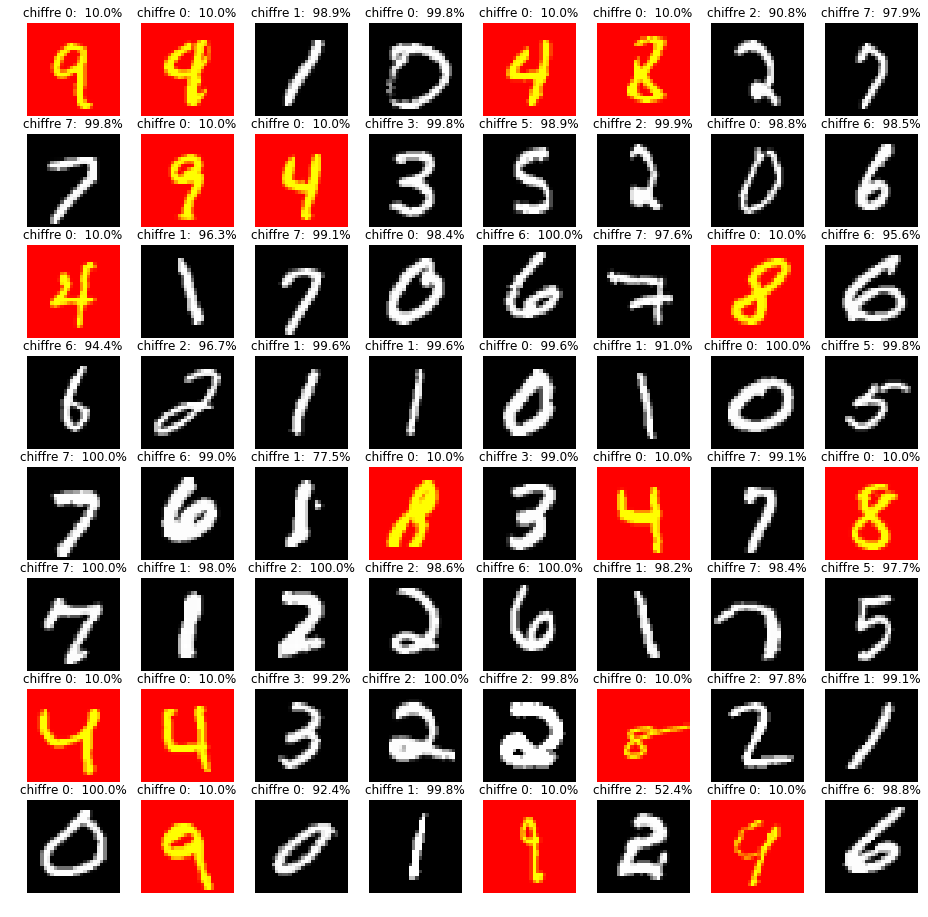

Dans cette exemple nous utilisons le jeu de donnée Mnist (disponible à l'adresse suivante http://yann.lecun.com/exdb/mnist) pour apprendre a classer  des images de chiffres de 0 à 9 écrits à la main.

Cette base de données est composé 60 000 images pour faire l'apprentissage et 10000 images pour tester notre algorithme d'apprentissage, Les images sont réparties en 10 classes qui correspondent à 10 chiffres différents: dans l'image suivante nous montrons un exemple des 10 types de classes.


<p style="text-align:center;"></p>


## Developpement: Exemple simple

On utilise la librairie pytorch qui permet de créer des réseaux de neurones de manière optimisé et qui à déjà intégré l'ensemble des formules mathématiques qui permettent de créer un réseau de neurone et de faire son apprentissage.
Nous utilisons la librairie torchvision également afin qu'on puisse envoyer les données dans le réseau de neurone


```python
import numpy as np
from torchvision.datasets import MNIST
import matplotlib.pyplot as plt
import torch
import torch.nn as nn
import torchvision.transforms as transforms
import torch.optim as optim
import torchvision.datasets as dsets
from torch.autograd import Variable
import torch.nn.functional as F
from sklearn.metrics import accuracy_score

CUDA = torch.cuda.is_available()
%matplotlib inline
```


```python
# Un objet python pour appliquer des transormation sur les images
transformation = transforms.Compose([
    transforms.ToTensor(), # on va convertir l'image en tenseur ( qui est une matrice à n dimension) de la taille 28x28x1
    transforms.Normalize((0.1307,), (0.3081,)) # on normalise les couleurs entre 0 et 1
])
# nombre d'image qui sont envoyé en meme temps dans le réseau
taille_batch=64

train_dataset = MNIST('./www/data/mnist', train=False, download=True,
                             transform=transformation)
train_loader = torch.utils.data.DataLoader(train_dataset, batch_size=taille_batch, shuffle=True)

test_dataset = MNIST('./www/data/mnist', train=False, download=True,
                            transform=transformation)
test_loader = torch.utils.data.DataLoader(test_dataset, batch_size=taille_batch, shuffle=True)
```


```python
class Net(nn.Module):
    def __init__(self):
        super(Net, self).__init__()
        self.fc1 = nn.Linear(784, 500)
        self.fc2 = nn.Linear(500, 100)
        self.fc3 = nn.Linear(100, 10)

    def forward(self, x):
        x = x.view(x.size(0),-1)
        x = F.relu(self.fc1(x))
        x = F.dropout(x, training=self.training)
        x = self.fc2(x)
        x = F.relu(self.fc3(x))
        x = F.dropout(x,training=self.training)
        return F.log_softmax(x, dim=1)
```


```python
def apprentissage(epochs=10):
    model = Net()
    if CUDA:
        model = model.cuda()
    model.train()

    loss_fn = nn.NLLLoss()
    optimizer = optim.Adagrad(model.parameters())
    epoch_loss = []
    epoch_accuracy = []
    for epoch in range(epochs):
        batch_loss = []
        for batch_num, (data, targets) in enumerate(train_loader):
            if CUDA:
                data,targets = Variable(data).cuda(), Variable(targets).cuda()
            else:
                data, targets = Variable(data), Variable(targets)
            optimizer.zero_grad()
            output = model(data)
            loss = loss_fn(output, targets)
            loss.backward()
            optimizer.step()
            batch_loss.append(loss.data[0])
        epoch_loss.append(sum(batch_loss) / len(batch_loss))
        accuracy = accuracy_score(targets.data.cpu().numpy(), output.data.cpu().numpy().argmax(axis=1))
        epoch_accuracy.append(accuracy)
        if epoch%5 == 0:
            print('Epoch {}:\t erreur {:.4f}\tprecision {:.2%}'.format(epoch, epoch_loss[-1], accuracy))

    return model, epoch_loss,epoch_accuracy

def test_model(model):
    # Test le réseau de neurone sur les données test
    print("Test le réseau sur des données test qui n'on jamais été observé par le réseau")
    model.eval()
    for i,(data, targets) in  enumerate(test_loader):
        if CUDA:
            outputs = model(Variable(data).cuda())
        else:
            outputs = model(Variable(data).cpu())
        log_probs, output_classes = outputs.max(dim=1)
        accuracy = accuracy_score(targets.cpu().numpy(), output_classes.data.cpu().numpy())
        print('Accuracy: {:.2%}'.format(accuracy))
        fig, axes = plt.subplots(8, 8, figsize=(16, 16))

        zip_these = axes.ravel(), log_probs.data.exp(), output_classes.data.cpu(), targets, data.cpu().numpy().squeeze()

        for ax, prob, output_class, target, img in zip(*zip_these):
            ax.imshow(img.reshape(28,28), cmap='gray' if output_class == target else 'autumn')
            ax.axis('off')
            ax.set_title('chiffre {}:  {:.1%}'.format(output_class, prob))
        plt.show()
        if i>=5:
            break

```


```python
model, epoch_loss,epoch_accuracy = apprentissage(epochs=3)
fig,axes = plt.subplots(1,2, figsize=(16,4))
axes = axes.ravel()
axes[0].plot(epoch_loss)
axes[0].set_xlabel('Epoch')
axes[0].set_title('Erreur')
axes[0].set_ylabel('valeur')

axes[1].plot(epoch_accuracy)
axes[1].set_xlabel('Epoch')
axes[1].set_title('Precision')
axes[1].set_ylabel('valeur')
plt.show()
test_model(model=model)
```

    /home/zakari/anaconda2/lib/python2.7/site-packages/ipykernel_launcher.py:23: UserWarning: invalid index of a 0-dim tensor. This will be an error in PyTorch 0.5. Use tensor.item() to convert a 0-dim tensor to a Python number


    Epoch 0:	 erreur 2.2648	precision 18.75%


    Test le réseau sur des données test qui n'on jamais été observé par le réseau
    Accuracy: 15.62%


    Accuracy: 28.12%


    Accuracy: 23.44%


    Accuracy: 25.00%


    Accuracy: 25.00%


    Accuracy: 14.06%


```python
model, epoch_loss,epoch_accuracy = apprentissage(epochs=120)
fig,axes = plt.subplots(1,2, figsize=(16,4))
axes = axes.ravel()
axes[0].plot(epoch_loss)
axes[0].set_xlabel('Epoch')
axes[0].set_title('Erreur')
axes[0].set_ylabel('valeur')

axes[1].plot(epoch_accuracy)
axes[1].set_xlabel('Epoch')
axes[1].set_title('precision')
axes[1].set_ylabel('valeur')
plt.show()
test_model(model=model)
```

    /home/zakari/anaconda2/lib/python2.7/site-packages/ipykernel_launcher.py:23: UserWarning: invalid index of a 0-dim tensor. This will be an error in PyTorch 0.5. Use tensor.item() to convert a 0-dim tensor to a Python number


    Epoch 0:	 erreur 2.3744	precision 0.00%
    Epoch 5:	 erreur 2.1921	precision 6.25%
    Epoch 10:	 erreur 2.1869	precision 6.25%
    Epoch 15:	 erreur 2.1899	precision 6.25%
    Epoch 20:	 erreur 1.9217	precision 12.50%
    Epoch 25:	 erreur 1.5711	precision 31.25%
    Epoch 30:	 erreur 1.5627	precision 31.25%
    Epoch 35:	 erreur 1.5400	precision 31.25%
    Epoch 40:	 erreur 1.5324	precision 43.75%
    Epoch 45:	 erreur 1.5046	precision 62.50%
    Epoch 50:	 erreur 1.5092	precision 31.25%
    Epoch 55:	 erreur 1.5380	precision 31.25%
    Epoch 60:	 erreur 1.5098	precision 62.50%
    Epoch 65:	 erreur 1.5249	precision 37.50%
    Epoch 70:	 erreur 1.5152	precision 31.25%
    Epoch 75:	 erreur 1.5199	precision 18.75%
    Epoch 80:	 erreur 1.4996	precision 31.25%
    Epoch 85:	 erreur 1.4874	precision 43.75%
    Epoch 90:	 erreur 1.5010	precision 43.75%
    Epoch 95:	 erreur 1.5004	precision 50.00%
    Epoch 100:	 erreur 1.5037	precision 50.00%
    Epoch 105:	 erreur 1.5243	precision 25.00%
    Epoch 110:	 erreur 1.5197	precision 43.75%
    Epoch 115:	 erreur 1.5052	precision 43.75%


    Test le réseau sur des données test qui n'on jamais été observé par le réseau
    Accuracy: 75.00%


    Accuracy: 73.44%


    Accuracy: 75.00%


    Accuracy: 73.44%





    Accuracy: 73.44%


    Accuracy: 65.62%


