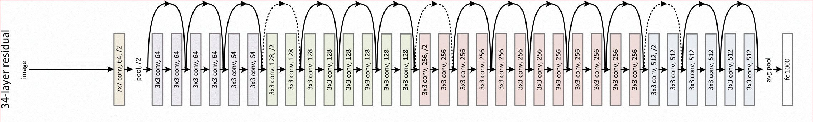
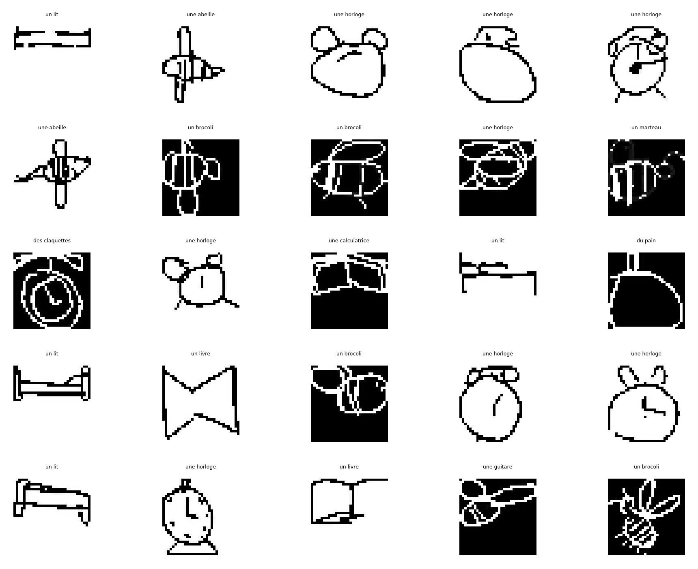
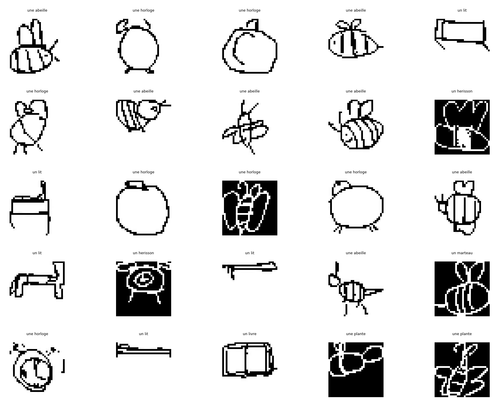
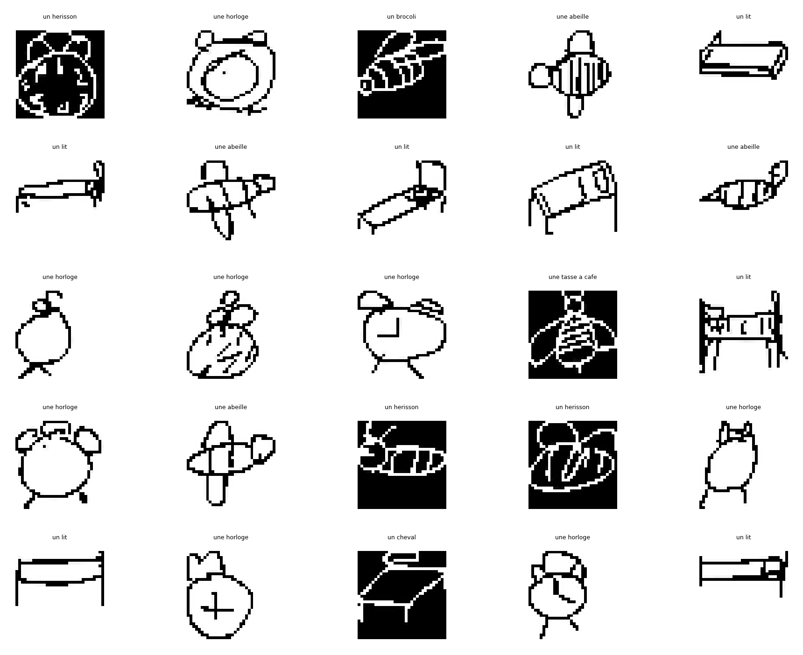
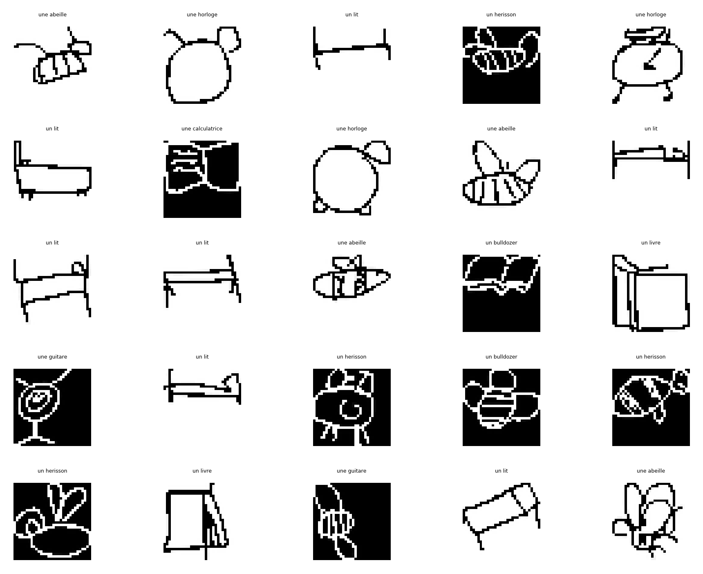
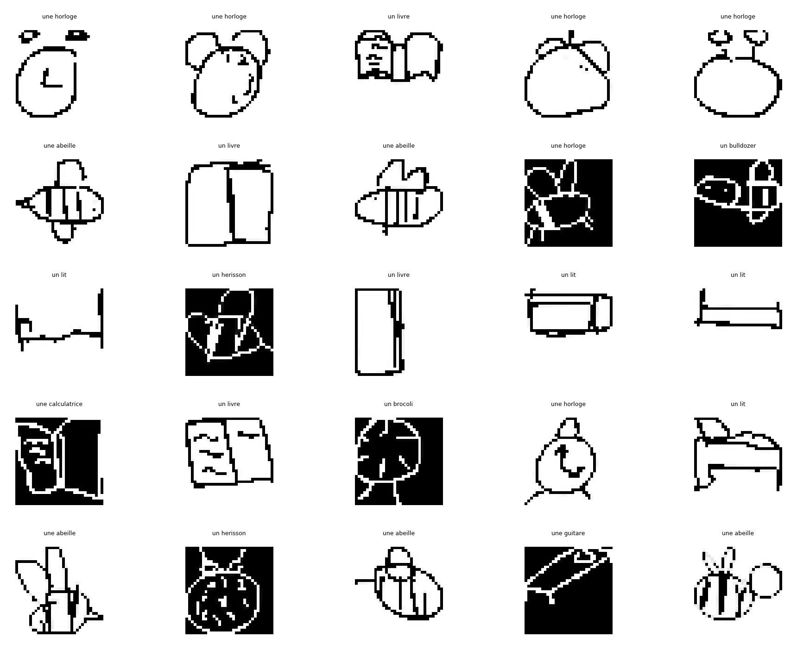
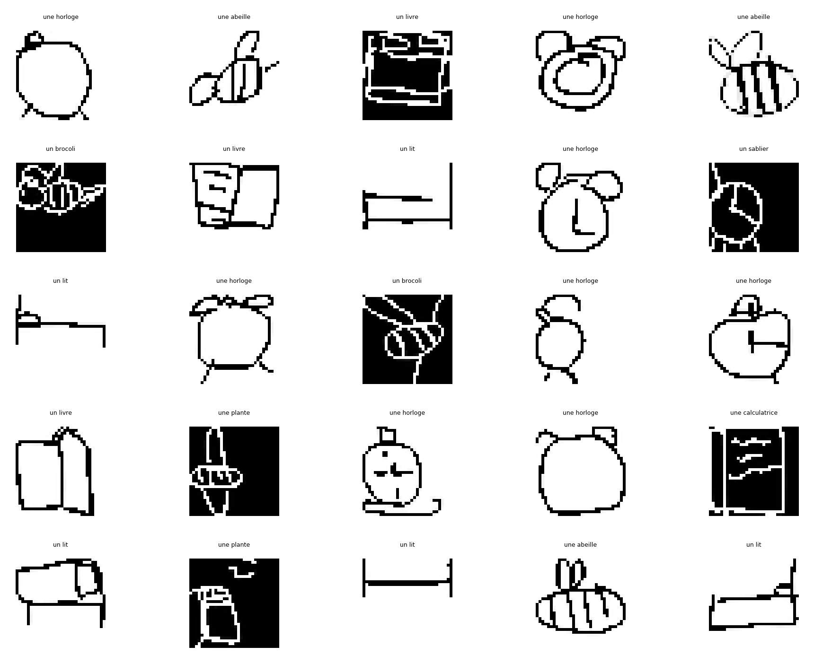
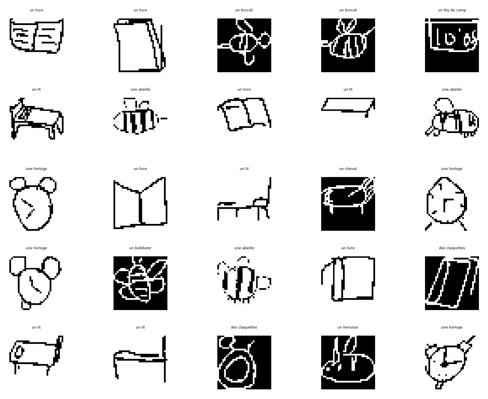
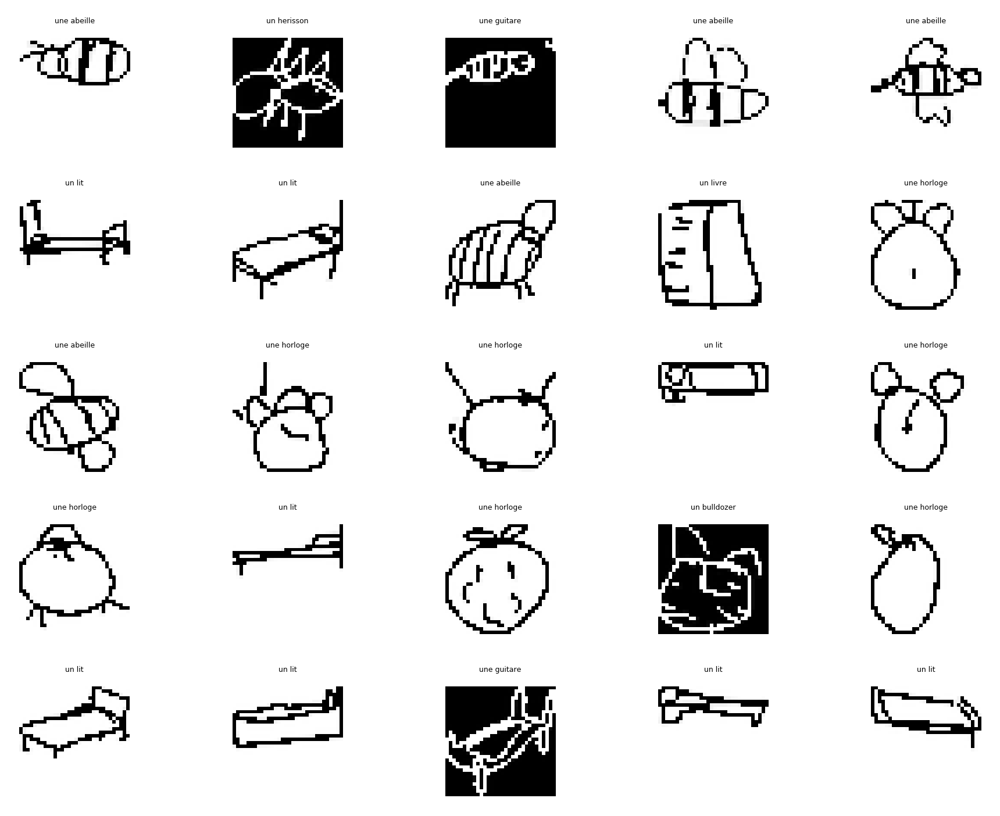
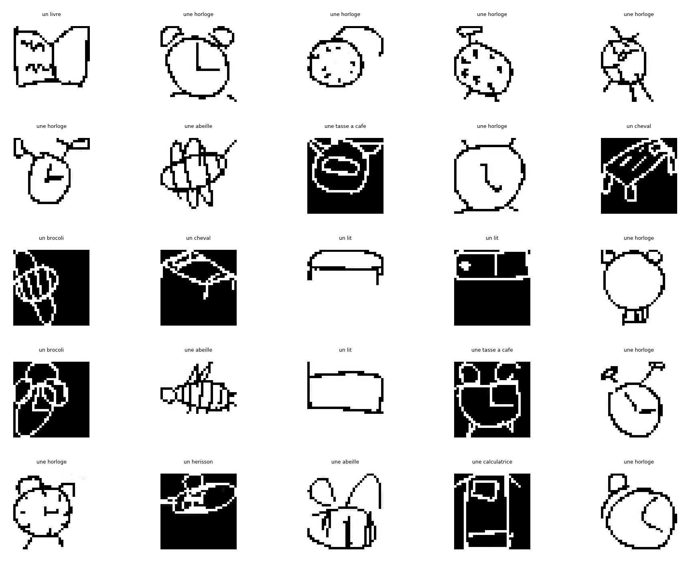

<section id="one">

<h1> Resnet 34 </h1>

	

<h1> Résultat après apprentissage </h1>

	

		<!-- Break -->

		<!-- Break -->

	

<h1> Demo Live </h1>
Nous avons réalisé une application web développé en python avec pytorch pour créer le réseau de neurone et le

<iframe src="https://quickdraw-10-classification.herokuapp.com/" name="frame2" frameborder="0" scrolling="auto" onload="" allowtransparency="True" width="100%" height="800"></iframe>

</section>

