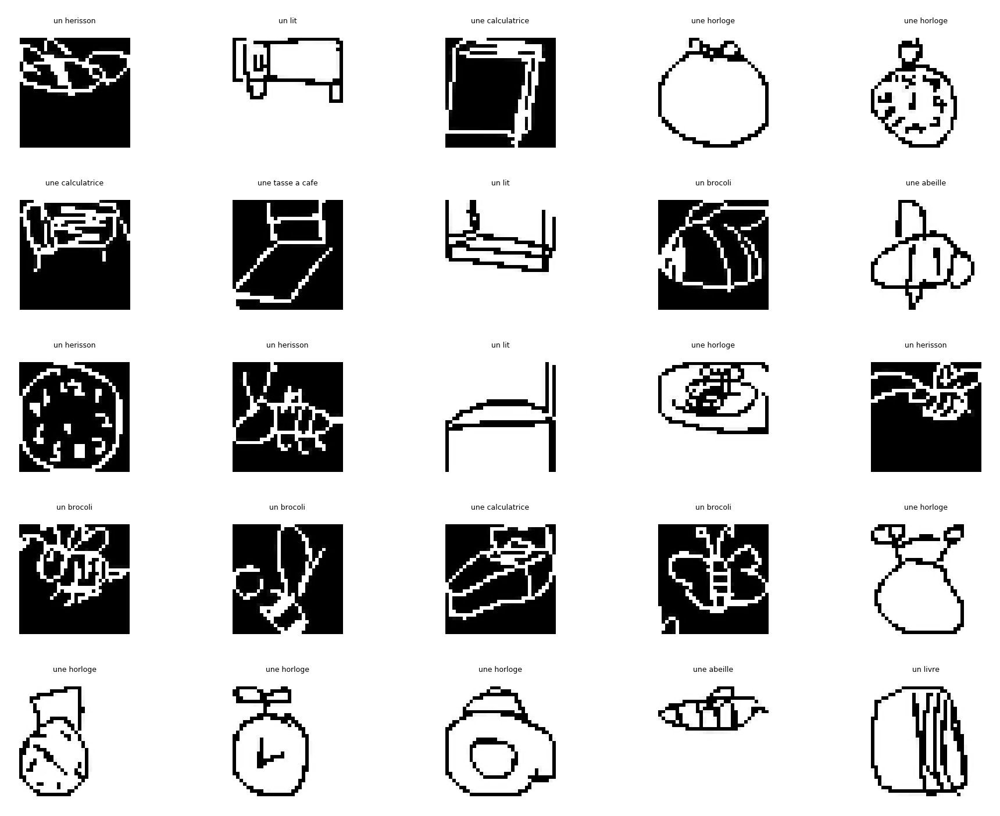
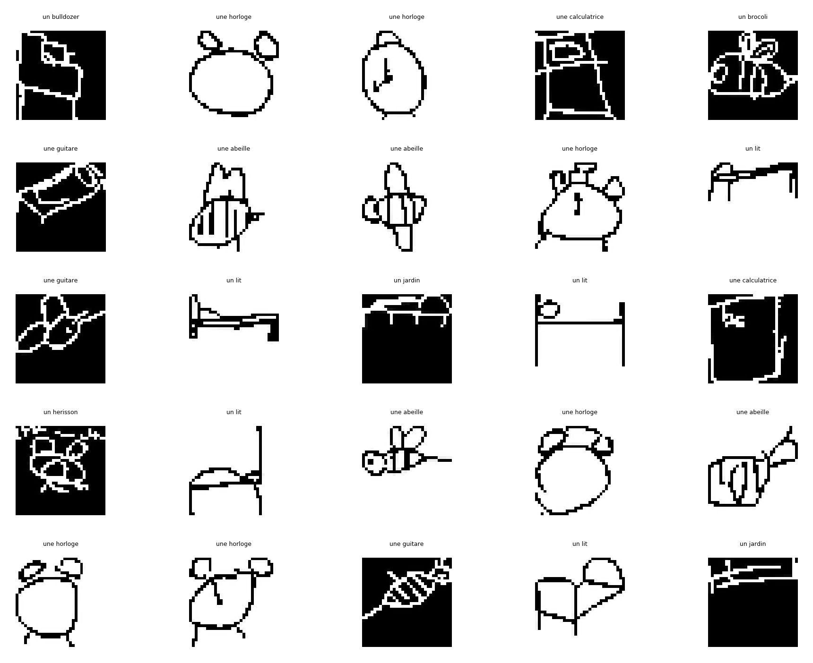
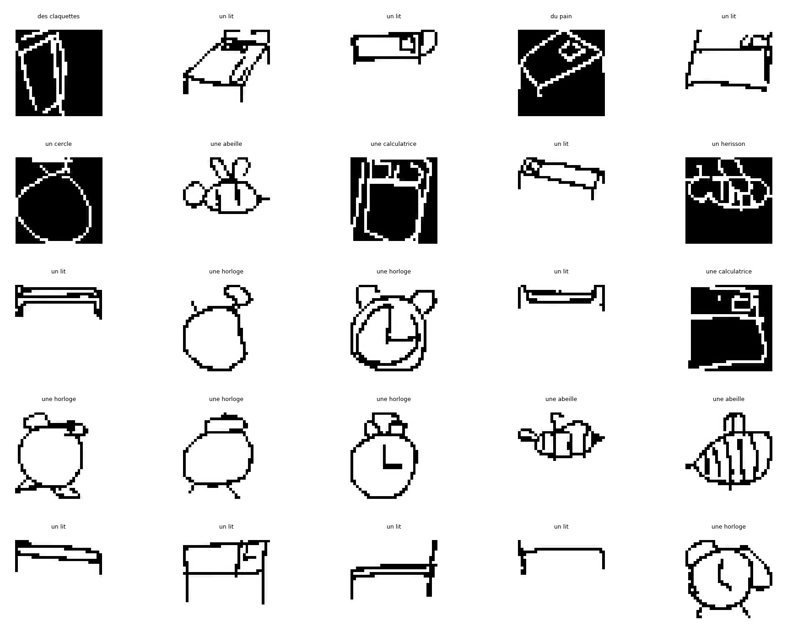
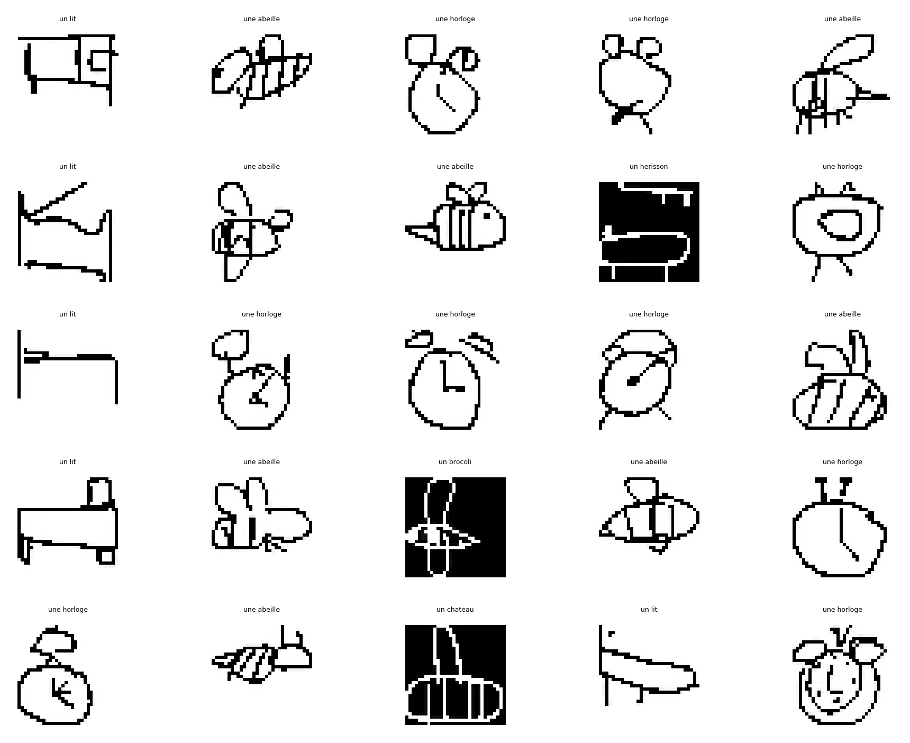
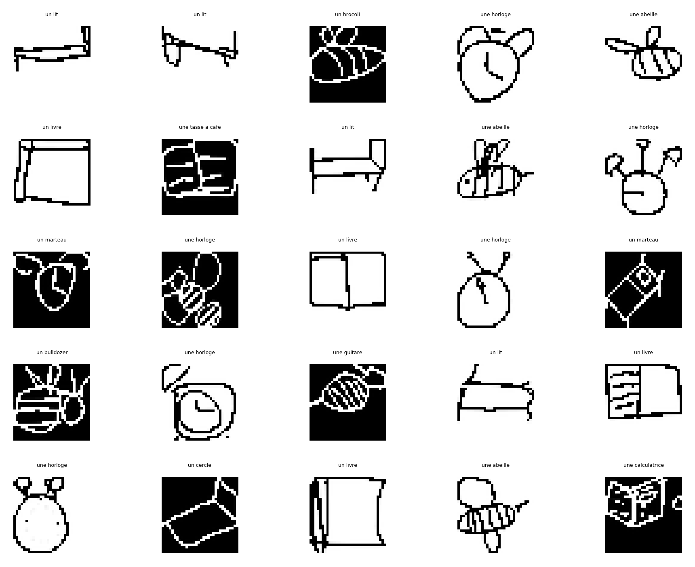
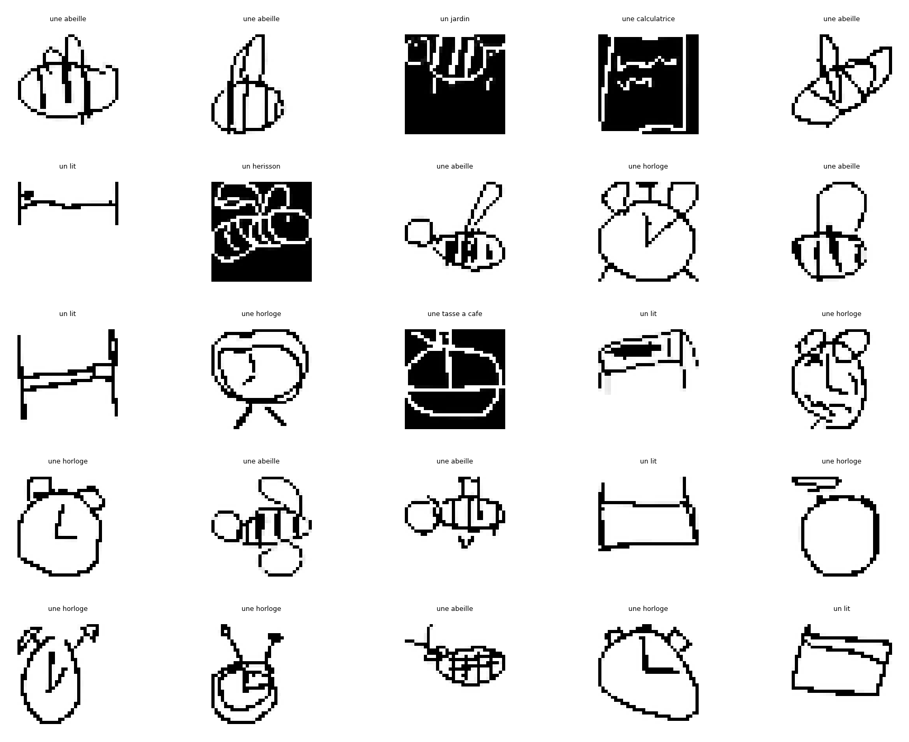
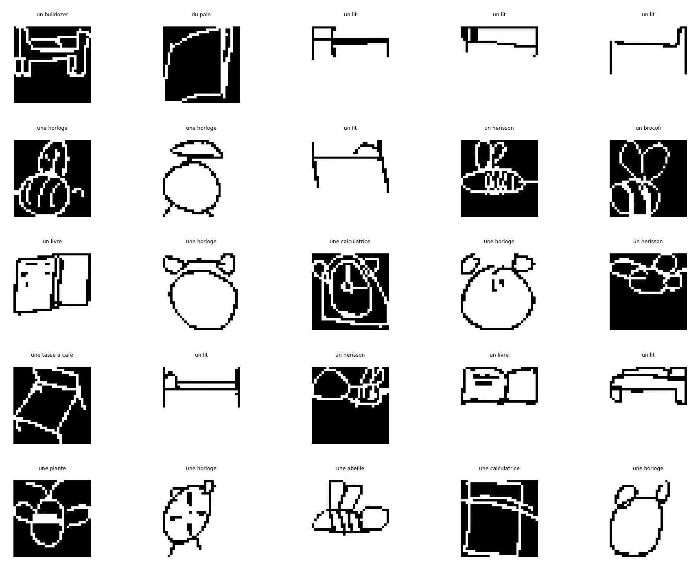
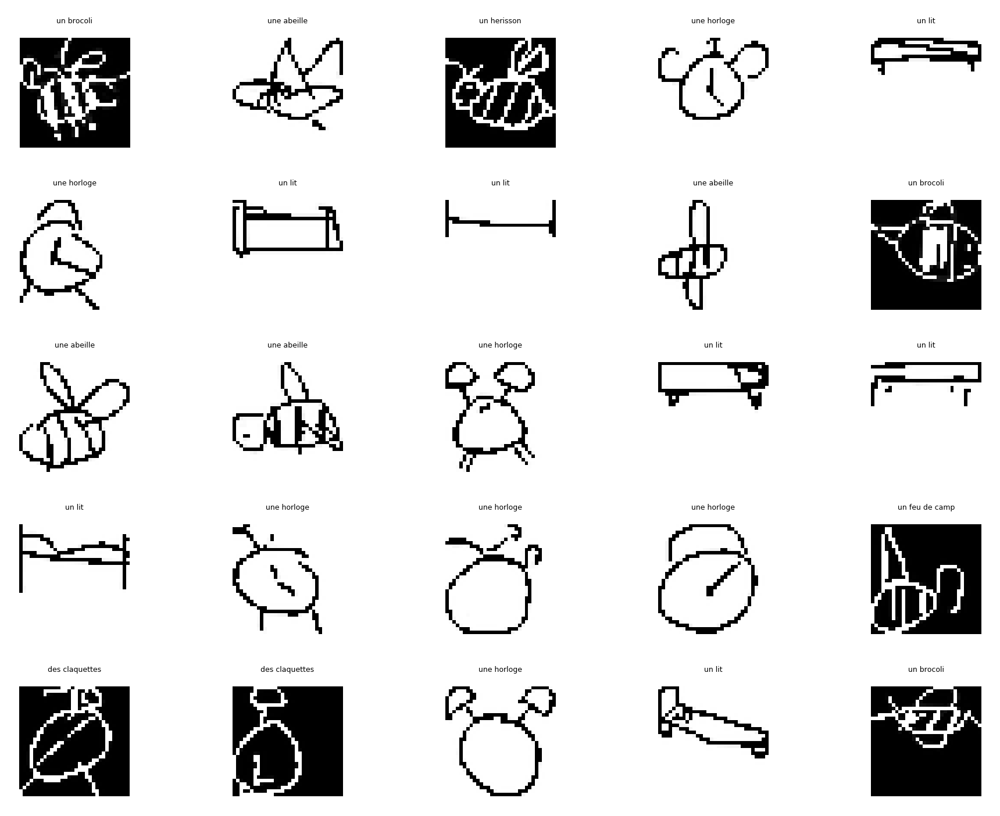
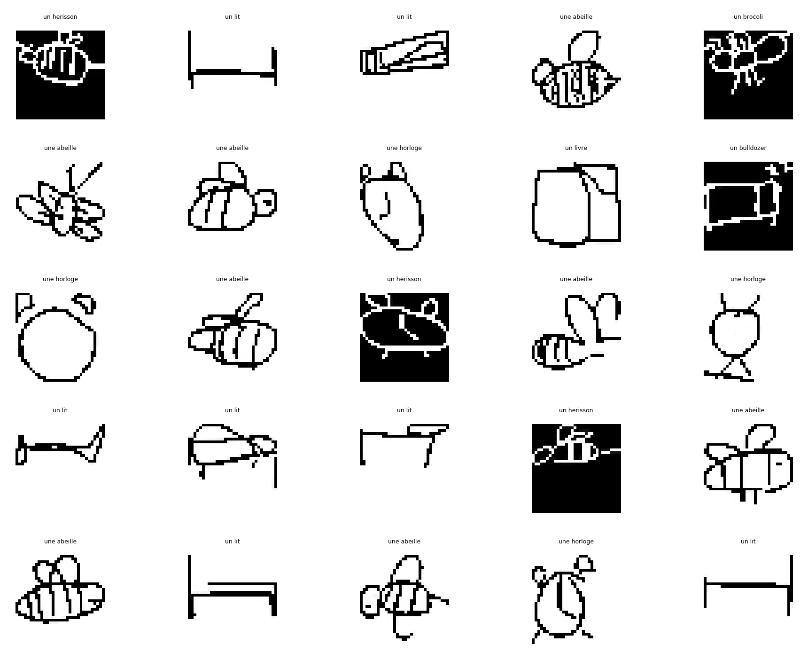

<section id="one">

<h1> Resnet 34 </h1>

	

	

<h1> Résultat après apprentissage </h1>

	

		<!-- Break -->

		<!-- Break -->

		<!-- Break -->

		<!-- Break -->

		<!-- Break -->

	

</section>

